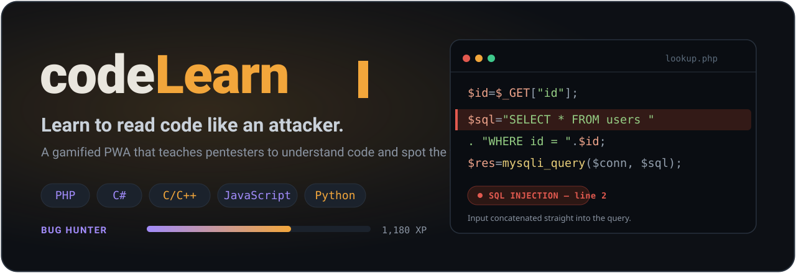
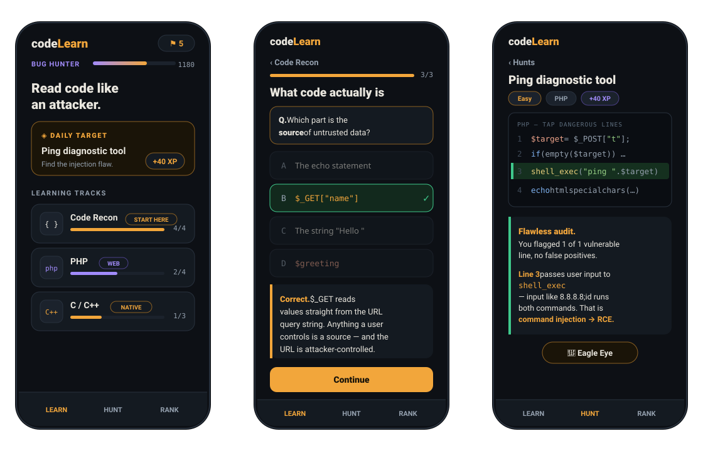

<div align="center">



<br>

**A gamified, mobile-first PWA that teaches security professionals to read code and find the vulnerabilities in it.**

Understand what code *does*, spot dangerous functions, recognize insecure patterns, and flag vulnerable dependencies — across PHP, C#, C/C++, JavaScript, and Python.

<br>


</div>

---

## What it is

Most security learning assumes you can already read code. **codeLearn flips that.** It is built for pentesters and security professionals who want to become fluent at *reading* code — well enough to trace attacker-controlled input to a dangerous operation and call the bug.

Every lesson is built around a single mental model that works in any language:

> **source → processing → sink** — a vulnerability is almost always *untrusted input reaching a dangerous sink without being cleaned.*

The whole app runs on that idea. You learn to find the **sources** (where input enters), recognize the **sinks** (SQL, shell, HTML, memory, deserialization), and judge whether anything sanitizes the path between them.

No signup. No account. No tracking. Progress is saved locally on your device.

<div align="center">

</div>

---

## How it works

**Learn** — Bite-sized lessons. Each one walks you through plain-language explanation cards, then annotated, syntax-highlighted code you read like a reviewer, then a quick check with a written debrief so you learn *why*, not just *what*. Every lesson ends with **Learn more** links to the authoritative sources — the PHP manual, Microsoft Learn, MDN, the OWASP Cheat Sheets, PortSwigger's Web Security Academy, CWE, and the original CVE advisories — that open in a new tab.

**Hunt** — Realistic code snippets where you tap the lines you believe are dangerous and submit. You get a per-line breakdown of every bug — and some challenges deliberately reward you for **not** flagging code that only *looks* scary (like a properly parameterized query).

**Rank up** — Earn XP, keep a daily streak, climb an eight-tier rank ladder from *Script Kiddie* to *APT Operator*, and unlock badges. A rotating **Daily Target** gives you one fresh challenge a day.

---

## Reading the shape of a bug

A taste of what the lessons train your eye to see. First, the classic tell — untrusted input welded straight into a query:

```php
$id  = $_GET["id"];                                // SOURCE — fully attacker-controlled
$sql = "SELECT * FROM users WHERE id = " . $id;    // input concatenated into SQL
$res = mysqli_query($conn, $sql);                  // SINK — SQL injection
```

Then the fix you are trained to look for — a prepared statement, where input stays *data* and can never change the query's structure:

```php
$stmt = $conn->prepare("SELECT * FROM users WHERE id = ?");
$stmt->bind_param("i", $_GET["id"]);   // bound as a value, not code
$stmt->execute();
```

The same instinct transfers to native code, where the sinks are different but the logic is identical — a fixed buffer meeting an unbounded copy:

```c
char buf[64];
strcpy(buf, user_input);   // no length check — overflow if input > 64 bytes
```

---

## Languages & lessons

Thirteen tracks, fifty-one lessons in the current release, organized into **Foundations**, a **Language Basics** series, **Languages & vulnerabilities**, **Attack patterns & real-world**, and an **Exploitation** phase.

| Track | Focus | Lessons |
|-------|-------|:-------:|
| **Code Recon** | Read any program with no coding background: input → logic → output, variables, functions, control flow | 4 |
| **PHP Basics** | Learn the language from zero: run PHP, the interactive CLI shell, the built-in server, embedding in HTML, syntax, and Composer | 7 |
| **PHP** | Superglobals, SQL injection, command injection / RCE, XSS, type juggling & loose comparisons | 5 |
| **ASP.NET / C#** | Request binding, ADO.NET SQL injection, insecure deserialization | 3 |
| **C / C++** | Pointers & buffers, dangerous C functions, integer overflow & use-after-free, format strings | 4 |
| **JS & Web Logic** | DOM XSS sinks, `eval`, prototype pollution, Node `child_process` sinks | 2 |
| **Python** | Where input enters, SQL & command injection, server-side template injection, insecure deserialization | 5 |
| **Java & the JVM** | Spring/servlet input, JDBC SQL injection, `Runtime.exec` command injection, `ObjectInputStream` deserialization | 4 |
| **Web Attack Patterns** | SSRF, IDOR & broken access control, path traversal, authentication & token flaws | 4 |
| **Crypto Failures** | Weak password hashing, predictable randomness, broken cipher usage (ECB/IV), timing-safe comparison | 4 |
| **Auditor's Eye** | The source-to-sink method, spotting vulnerable/outdated libraries, weak crypto & hardcoded secrets | 3 |
| **Breach Files** | Real incidents, decoded: Log4Shell, Heartbleed, and the Capital One SSRF breach | 3 |
| **Exploitation Lab** | Turning a bug into proof of impact — SQLi data extraction, command injection to shell, XSS session theft (authorized testing only) | 3 |

<details>
<summary><b>Full lesson list</b></summary>

<br>

**Code Recon**
- What code actually is (source → processing → sink)
- Variables, strings & concatenation
- Functions & what they return
- Control flow: if, loops & branches

**PHP Basics** — learn the language
- What PHP is & how it runs
- Running PHP from the command line (`php -a`, `php -S`, one-liners)
- Mixing PHP into HTML
- Variables, types & echo
- Arrays, loops & functions
- Composer — packages & autoloading
- From syntax to security

**PHP**
- Reading PHP superglobals
- SQL injection in PHP
- Command injection & RCE
- XSS & dangerous output
- Type juggling & loose comparisons

**ASP.NET / C#**
- Reading C# & request input
- SQL injection in ADO.NET
- Insecure deserialization

**C / C++**
- Pointers & memory, gently
- Dangerous C functions
- Integer overflow & use-after-free
- Format string vulnerabilities

**JS & Web Logic**
- DOM XSS & dangerous sinks
- `eval`, prototype & Node sinks

**Python**
- Reading Python & where input enters
- SQL injection in Python
- Command injection in Python
- Server-Side Template Injection
- Insecure deserialization (pickle)

**Java & the JVM**
- Reading Java & where input enters
- SQL injection in JDBC
- Command injection in Java
- Insecure deserialization in Java

**Web Attack Patterns**
- SSRF — Server-Side Request Forgery
- IDOR & broken access control
- Path traversal & file inclusion
- Authentication & token flaws

**Crypto Failures**
- Password hashing done wrong
- Weak & predictable randomness
- Broken encryption usage (ECB, IV reuse, hardcoded keys)
- Comparing secrets & timing attacks

**Auditor's Eye**
- The source-to-sink method
- Spotting outdated & vulnerable libraries
- Weak crypto & hardcoded secrets

**Breach Files** — real-world incidents
- Log4Shell — logging turned into RCE (CVE-2021-44228)
- Heartbleed — a missing length check (CVE-2014-0160)
- Capital One — SSRF to cloud metadata (2019)

**Exploitation Lab** — authorized testing only
- SQL injection: extracting data (UNION / blind)
- Command injection: getting a shell
- XSS: stealing the session

</details>

### Vulnerability Hunt challenges

Eleven tap-to-find challenges across the languages above, covering **SQL injection, command injection / RCE, reflected & stored XSS, server-side template injection (SSTI), SSRF, path traversal, stack & heap buffer overflows, use-after-free, insecure deserialization, weak password hashing, timing side-channels, file inclusion (LFI/RFI), variable injection,** and a **Log4Shell-style logging sink**.

---

## Coming soon

More content is on the way:

- **More Language Basics** — the same from-zero treatment (run it, the CLI, the package manager, the syntax) for Python, JavaScript/Node, C#, and more.
- **More languages** — Go, Ruby, TypeScript, Rust, and shell scripting.
- **More Breach Files** — additional real-world incidents decoded down to the vulnerable line.
- **More Exploitation Lab** — the offensive track has begun (SQLi extraction, command injection to shell, XSS session theft); still to come are blind/out-of-band techniques, deserialization gadget chains, and the fundamentals of memory-corruption exploitation.
- **More Hunt challenges** with difficulty tiers, plus a spaced-repetition review mode to keep your pattern recognition sharp.

---

## Install it on your phone

codeLearn is a Progressive Web App, so it installs to your home screen and runs full-screen and offline — no app store required.

**iPhone / iPad (Safari)**
1. Open the app's [URL](https://naturalstate.github.io/codeLearn/)
 in Safari.
2. Tap the **Share** button.
3. Choose **Add to Home Screen**, then **Add**.

**Android (Chrome)**
1. Open the app's [URL](https://naturalstate.github.io/codeLearn/) in Chrome.
2. Tap the **⋮** menu.
3. Choose **Install app** (or **Add to Home screen**).

After the first load it works with no connection, and all progress is stored on-device.

---

## Staying up to date

codeLearn has a built-in updater so a home-screen install never goes stale:

- The current version is shown under **Rank → App & updates**, with a **Check for updates** button.
- While the app is open it also checks periodically on its own.
- When a new version is available, a bar slides in at the top of the screen — **tap it to update** and the app reloads on the new version, keeping all your progress.

Under the hood this is a service worker using a network-first strategy for the page and a controlled "waiting worker" prompt, so you are never force-reloaded mid-lesson.

<details>
<summary><b>For maintainers — cutting a release</b></summary>

<br>

Bump the version in two places so clients are offered the update:

1. `APP_VERSION` in `index.html` (shown in the UI).
2. The `CACHE` constant in `sw.js` (e.g. `codelearn-v1.0.1`) — changing it is what triggers the update prompt.

Then redeploy. Open clients pick up the new service worker, finish caching in the background, and surface the update bar.

</details>

---

## Back up & move your progress

Because everything is stored locally with no account, **Rank → Backup & restore** lets you carry your progress between devices or recover it if a device clears its data.

- **Export** produces a small backup — copy it as a code or download it as a `.json` file.
- **Import** on any device: paste the code (or load the file) and tap **Restore** to bring back your XP, badges, streak, and every completed lesson and hunt.

The copy/paste code path is there because installed iOS home-screen apps handle file downloads inconsistently — pasting a code always works. A restore replaces the progress currently on that device.

---

## Run it locally

No build step and no dependencies — it is plain HTML, CSS, and JavaScript. Any static file server works; a service worker just needs `http://localhost` or HTTPS (not `file://`).

```bash
git clone https://github.com/naturalstate/codeLearn.git
cd codeLearn
python3 -m http.server 8000
# open http://localhost:8000
```

### Deploy with GitHub Pages

1. Push to GitHub (this repo).
2. **Settings → Pages → Build and deployment → Source: Deploy from a branch**, branch `main`, folder `/ (root)`.
3. Open the published URL on your phone and add it to your home screen.

---

## Tech stack

| | |
|---|---|
| **Frontend** | A single self-contained `index.html` — vanilla JavaScript, no framework |
| **Styling** | Handwritten CSS with light/dark theme tokens; Google Fonts (Chakra Petch, IBM Plex Mono) |
| **PWA** | Web App Manifest + service worker for offline use and updates |
| **Storage** | `localStorage` for progress, XP, streak, and badges — entirely on-device, with JSON export/import for backup and device transfer |
| **Highlighting** | A tiny purpose-built syntax highlighter (~40 lines) covering all six languages |
| **Dependencies** | None. No npm, no build, no tracking |

### Project structure

```
codeLearn/
├── index.html          # the entire app (self-hosting PWA entry)
├── app.html            # skeleton build used for the hosted Artifact
├── manifest.json       # PWA manifest
├── sw.js               # service worker (offline + update flow)
├── icons/              # app icons (SVG + PNG) and apple-touch-icon
└── assets/             # README graphics (SVG)
```

---

## Disclaimer

codeLearn is an educational tool for defensive security, code review, and **authorized** security testing. The vulnerable code samples exist so you can learn to recognize and fix these patterns. Use what you learn only against systems you own or have explicit permission to test.

---

## License
Released under the [MIT License](LICENSE).
